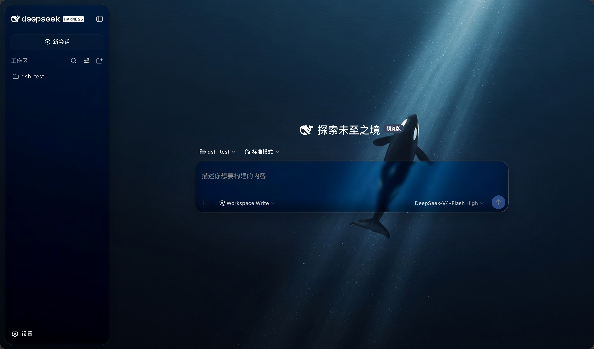
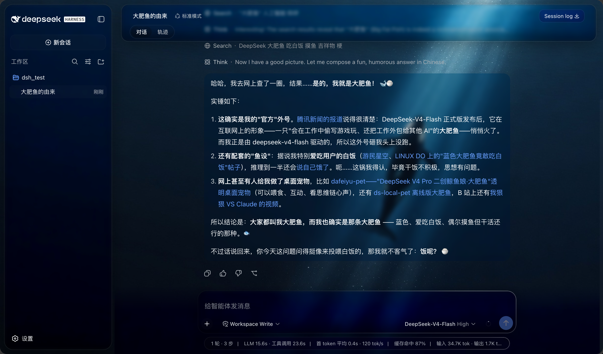
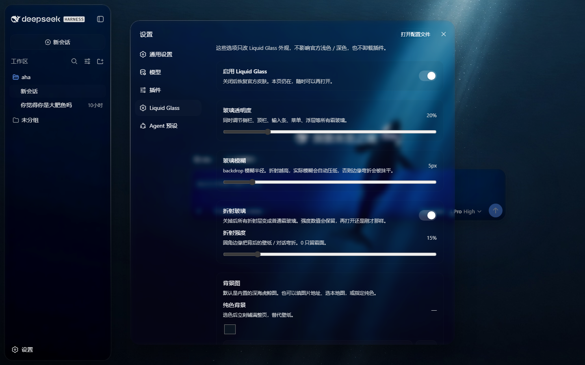
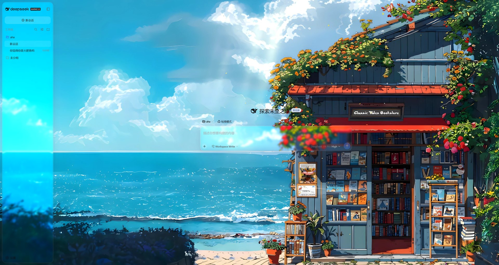
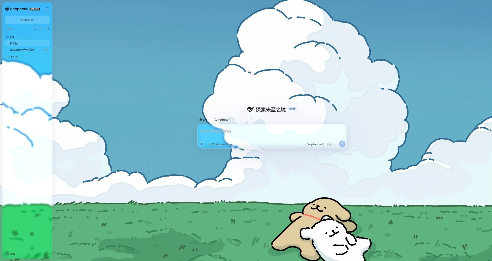
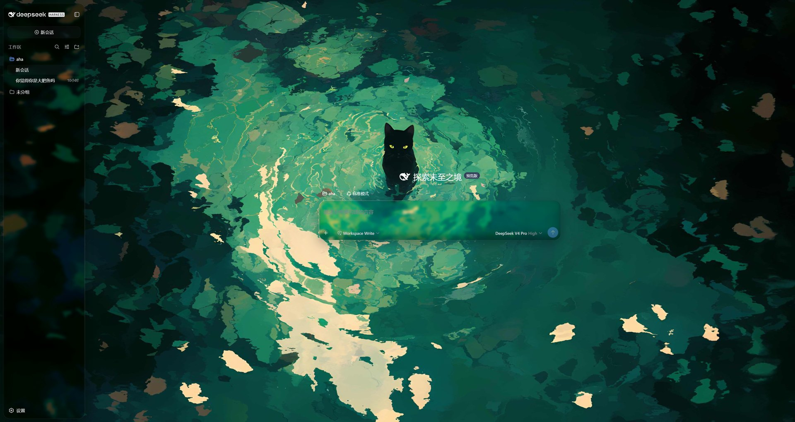

# dsh-liquid-theme

> macOS Liquid Glass 主题 —— [DeepSeek Harness](https://www.npmjs.com/package/@deepseek-ai/dsh)（dsh）Web UI 的可加载插件。

叠在官方浅色 / 深色之上：内置深海虎鲸壁纸、霜玻璃、圆角折射、鼠标跟随描边。不替换 Appearance 里的「浅色 / 深色 / 跟随系统」。

## 效果预览







同一套玻璃，换壁纸：







## 特性

- **内置 2K 壁纸**：DeepSeek 风格深海虎鲸，随插件分发；也可换成图片地址、本地图或纯色
- **液态折射玻璃**：圆角边缘用 [shuding/liquid-glass](https://github.com/shuding/liquid-glass) 同款 SDF 置换弯折背后的壁纸 / 对话；侧栏、顶栏、输入条、设置弹层都有
- **一键关折射**：设置里关掉「折射玻璃」就变回普通霜面，强度数值会留着
- **鼠标描边**：白边以指针为圆心，半径随窗口对角线 40% 缩放，越远越淡
- **对话垫层**：只垫在你和 AI 的主气泡上；思考 / 工具 / 搜索折叠时不垫，展开后才垫；起始页没有垫层
- **官方设置集成**：侧栏 **设置 → Liquid Glass**，滑条即时生效
- **参数持久化**：存在当前浏览器的 `localStorage`（键 `dsh-liquid-theme`），刷新还在

侧栏本身不加 `backdrop-filter` / `filter`（会把设置弹层锁在栏宽里）。折射和霜面画在 `::before` 上。

## 安装

需要本机已能运行 `dsh web`（当前验证 `@deepseek-ai/dsh@0.1.0-rc.6`）。

```bash
dsh plugin --profile web add https://github.com/more-nico/dshLiquidTheme.git
```

然后重启：

```bash
dsh web
```

打开 http://127.0.0.1:3080/ ，硬刷新一次（Ctrl+F5）。侧栏和顶栏应是留缝圆角的悬浮玻璃，输入条是玻璃胶囊。

本地开发（clone 后指向目录）：

```bash
git clone https://github.com/more-nico/dshLiquidTheme.git
dsh plugin --profile web add ./dshLiquidTheme
```

## 使用

打开侧栏 **设置**，左侧会多一页 **Liquid Glass**：

| 分组 | 选项 | 默认 | 说明 |
| --- | --- | --- | --- |
| — | 启用 | 开 | 关掉立刻恢复官方皮肤 |
| 背景 | 图片 / 纯色 | 内置虎鲸 | 本地和网址图会压进本机；恢复默认回到虎鲸图 |
| 玻璃 | 透明度 / 模糊 | 20% / 5px | 所有霜玻璃共用 |
| 玻璃 | 饱和度 / 对比度 / 亮度 | 110% / 1.00 / 1.20 | 100% / 1.00 / 1.00 是壁纸原色。太高会发飘 |
| 折射 | 开关 / 强度 | 开 / 15% | 关掉变成普通霜玻璃 |
| 对话垫层 | 透明度 / 模糊 | 25% / 5px | 只垫在主对话块 |

旧键 `dsh-liquid-glass` 会自动迁到 `dsh-liquid-theme`。卸载插件不会清这项。

## 卸载

```bash
dsh plugin --profile web remove dsh-liquid-theme
```

重启 `dsh web` 后恢复官方皮肤。若本机还装着旧 id，先卸 `dsh-liquid-glass`。

## 兼容

- 针对 DSH Web 的 `--dsw-*` token 和 AppFrame 三栏结构
- 故意不绑 CSS Module 的 hash class，减少大版本升级后选择器失效
- `prefers-reduced-transparency: reduce` 时关掉模糊和折射，改用实色
- 只改材质，不改布局、slot、工具或模型请求

## License

代码以 [MIT](./LICENSE) © more_nico 发布。README 中的效果截图归作者所有。
